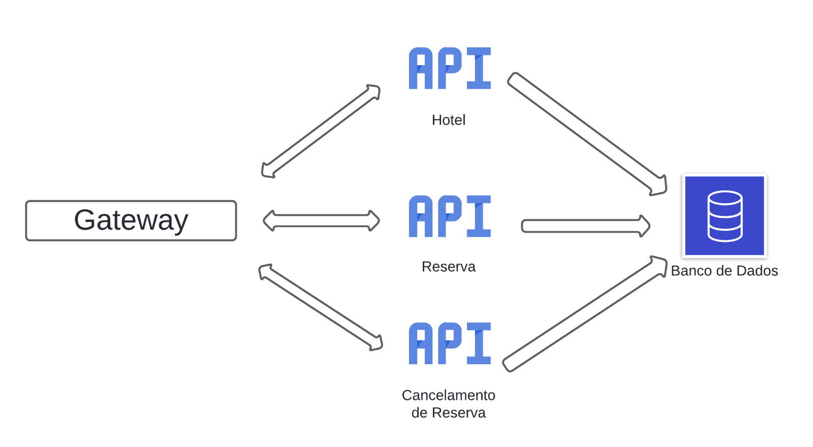

# DEMO-HOTEL-MICROSERVICES



Serviço de busca de hoteis, realização e cancelamento de reservas através de APIs .

## Índice
- <a href= "#funcionalidades">Funcionalidades do Projeto</a>
- <a href= "#tecnologias">Tecnologias Utilizadas</a>
- <a href= "#microsservicos">Microsserviços</a>
- <a href= "#dados">Base de Dados</a>
- <a href= "#rodar">Como rodar este projeto?</a>


## Funcionalidades do Projeto

- Busca de Hotéis por data, localização, e disponibilidade.
- Reserva de Quartos.
- Cancelamento de Reservas.
- Cadastro de uma Reserva.

## Tecnologias Utilizadas

- Java 21.
- Spring Boot 3.2.5.
- Railway para base de dados em nuvem.
- MySQL 8.3. 
- Postman ou Insomnia para testes.

## Microsserviços

### Serviço de Busca de Hotéis


Gerencia informações de hotéis e disponibilidade de quartos.<br/>Disponível em:

    http://localhost:8082

Documentação Swagger disponível através do navegador em:

    http://localhost:8080/api/v1/hoteis/swagger

Repositório disponível em:

https://github.com/Washington-A/demo-hotel-api

### Serviço de Reservas

Gerencia o processo de reserva de quartos.<br/>Disponível em:

    http://localhost:8083

Documentação Swagger disponível através do navegador em:

    http://localhost:8080/api/v1/hoteis/reserva/swagger

Repositório disponível em:

https://github.com/NayCristina/demo-hotel-reservas-api

### Serviço de Cancelamento

 Gerencia o cancelamento de reservas.<br/>Disponível em:

    http://localhost:8084

Documentação Swagger disponível através do navegador em:

    http://localhost:8080/api/v1/reservas/cancelamento/swagger

Repositório disponível em:

https://github.com/NicollasSilvaG/demo-hotel-cancelamento-api

### Gateway

O projeto contém um serviço de gerenciamento de rotas (Gateway) disponível para direcionar as requisições para seus devidos microsserviços.<br/>
Gateway disponível em:

    http://localhost:8080

Repositório disponível em:

https://github.com/LucasS1L/demo-hotel-microservices-gateway

## Base de Dados

O banco de dados está hospedado  na plataforma railway a partir de uma imagem docker.

```
Host: roundhouse.proxy.rlwy.net
Porta: 19161
User: root
Password: xFMLHGHFgoTjrQkoKrbnKhyMWLIUsdRA
```
## Como rodar este projeto?

- Clone todos os quatro repositórios
```
$ git clone linkRepository
```
- Execute as quatro aplicações simultaneamente


### Como fazer uma requisição para o serviço de busca de hotéis

Para fazer essa requisição, é necessário que no corpo seja fornecido o seguinte caminho:

    /api/v1/hoteis

Exemplo:

    http://localhost:8080/api/v1/hoteis

### Como fazer uma requisição para o serviço de reservas

Para essa requisição, é necessário que no corpo seja fornecido o seguinte caminho:

    /api/v1/reservas

Exemplo:

    http://localhost:8080/api/v1/reservas

### Como fazer uma requisição para o serviço de cancelamento de reservas

Para essa requisição, é necessário que no corpo seja fornecido o seguinte caminho:

    /api/v1/reservas/cancelamento

Exemplo:

    http://localhost:8080/api/v1/reservas/cancelamento

